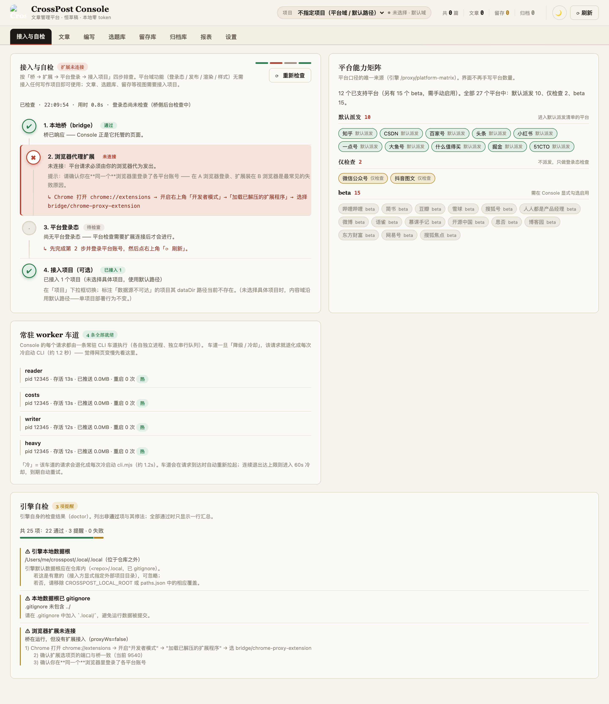
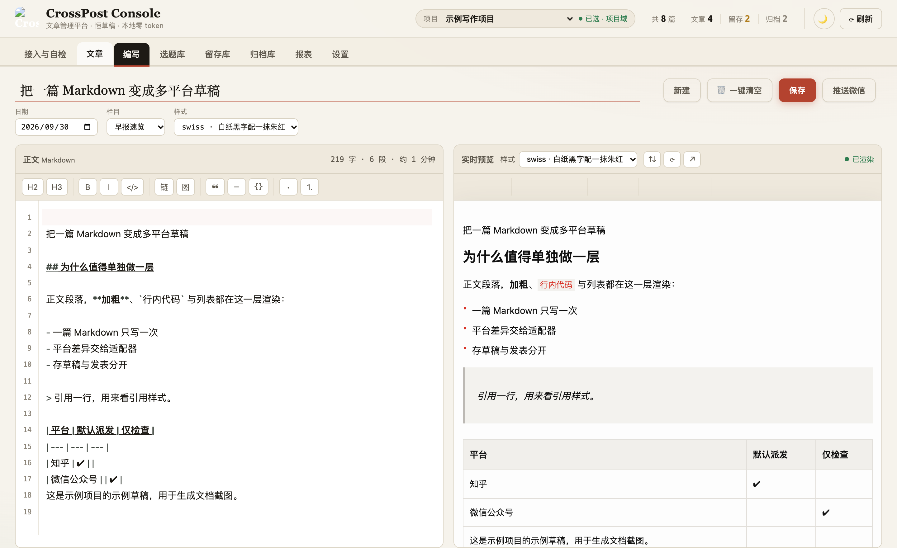
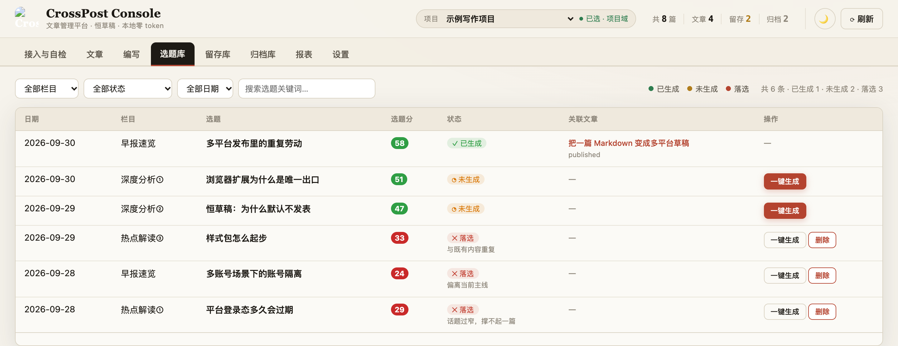
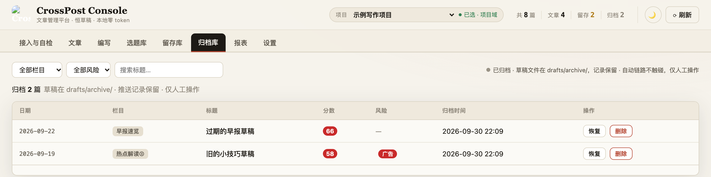
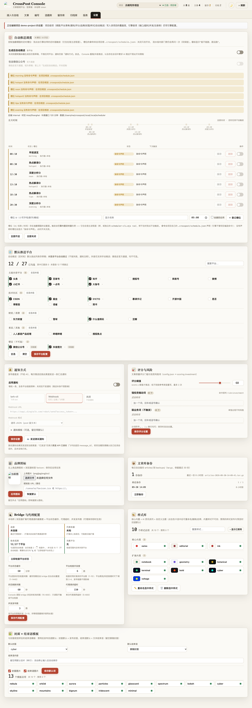
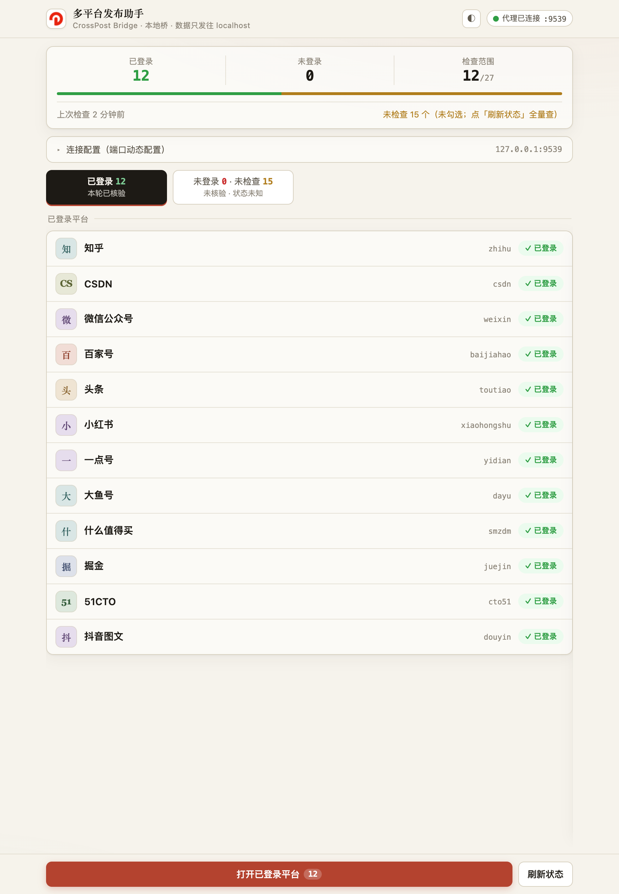

# CrossPost 发布引擎

把一篇 Markdown 变成多个平台的**草稿**，并把"发得出去吗、登录态还在吗、内容长什么样"
变成可查、可诊断、可接入的能力。

**它是引擎，不是写作系统。** 写作（选题、评分、写作规范、内容日历）属于接入它的
写作项目；两者永久分离——引擎不知道你的目录结构、你的选题库格式、你的写作 SOP，
你也不需要改引擎的代码。

> **恒草稿 · 单通道（无中转服务器）· 数据不离开你的设备**

当前版本 **v2.5**。

## 它由什么组成

```
Console(浏览器)  CLI  MCP  DSH preset          ← 入口
        └────────────┬────────────┘
              bridge/（本机常驻桥）              ← 鉴权 · 项目 · 调度 · 静态页
        ┌────────────┴────────────┐
  crosspost-runtime（引擎）   chrome-proxy-extension（唯一出口）
        └─ core/（渲染核心）           └─ 在真实页面里代发请求 → 存草稿
```

细节、数据流与"四条常驻 worker 车道"见 [`docs/architecture.md`](docs/architecture.md)。

## 系统要求

| 要求                      | 说明                                                                                                                        |
| ------------------------- | --------------------------------------------------------------------------------------------------------------------------- |
| **Node.js ≥ 24**          | 强制：6 处 `engines`、`.nvmrc` 与 `.npmrc` 的 `engine-strict` 一起把关，旧 Node 装不上                                      |
| **Chrome / Edge / Brave** | 任一即可。平台请求**唯一**的出口是浏览器扩展（在你的登录态下代发），所以它是硬前置                                          |
| macOS / Linux / Docker    | 三平台同一套语义（[`docs/installation.md`](docs/installation.md) · [`docs/docker.md`](docs/docker.md)）；Windows **未验证** |

## 三步上手

```bash
# 1) 初始化：建数据目录、生成配置、装齐子包依赖（runtime / bridge）、构建渲染核心
npm install
npm run setup

# 2) 启动桥（三选一）
node bridge/run-bridge.mjs                 # 前台
bridge/install-launchd.sh print            # macOS：先看会写成什么 plist（不落盘、不调 launchctl）
bridge/install-launchd.sh install          # macOS 守护（登录自启 + 崩溃重启）
bridge/install-systemd.sh install 9539     # Linux systemd 用户单元

# 3) 装浏览器扩展 + 自检
#    chrome://extensions → 开发者模式 → 加载已解压的扩展程序
#    → 选择 bridge/chrome-proxy-extension
npm run doctor                             # 期望 0 失败项
```

然后打开 **http://127.0.0.1:9540/** —— Console 的「接入与自检」页会把
「桥 → 扩展 → 平台登录 → 接入项目」四步的当前状态与**可以照着做的修复动作**列出来。

**没有写作项目也能跑完这三步**：引擎的默认域可以是空的。要让引擎管你的草稿，
再做一次[项目接入](docs/integration.md)——放一个 `.crosspost/project.json` 就行。

## 界面

Console 是桥托管的本地页面（`http://127.0.0.1:9540/`）。页面上的平台数量、样式清单、
自检结果与 worker 车道状态全部来自引擎接口，前端不写死任何口径。下面九张图取自一台干净的
沙箱实例（一个示例写作项目 + 四篇示例草稿）：前八张对应 Console 导航上的八个模块，
最后一张是浏览器扩展自己的选项页；报表的费用与扩展页的登录态为演示数据。

### 接入与自检



「桥 → 扩展 → 平台登录 → 接入项目」四步的当前状态；没通过的那一步直接给出可照做的修复动作。

### 文章


每篇一行：栏目、风险、评分、各平台结果矩阵与总状态；顶部统计与平台成功率都从记录聚合。

### 编写



左边正文、右边实时预览，标题 / 日期 / 栏目 / 样式在抬头区；保存只写草稿，推送微信也只建官方草稿。

### 选题库



每轮评分后的候选入池，按栏目筛选；落选可删（删前自动备份），已生成的选题直接链到文章。

### 留存库


低分与高风险内容的人工缓冲：只支持恢复或删除，自动链路不参与。

### 归档库



归档的草稿仍留在库里，可以恢复回文章列表，也可以彻底删除。

### 报表


产出量、平台成功率、状态构成与生成费用都在本地聚合，不经网络；费用按会话 usage 逐 step 计。

### 设置



平台、通知、评分与风险、品牌图标、备份、桥与代理、样式库、封面模板、定时槽位。

### 浏览器扩展选项页



扩展自己的选项页（`chrome-extension://<扩展 ID>/options.html`，在 `chrome://extensions`
的扩展卡片上点「扩展程序选项」即可打开；ID 由扩展目录的加载路径决定，同一份代码在不同路径下
装出来就是不同的 ID）。顶部三格读数是**已登录 / 未登录 / 检查范围**，配一条三态比例条；
两个 tab 分别列出「已登录」与「未登录 · 未检查」的平台 —— 没查过 ≠ 未登录，所以
「未登录 0」旁边必须同时写出「未检查 15」，在 tab 上这两个数字还分别用红与琥珀上色。
最下面是连接配置（host + WS 端口，HTTP 端口恒为 WS + 1）与刷新按钮。

## 支持的平台

**27 个已知平台**，分三级。唯一口径是 `crosspost-runtime/src/platform-matrix.mjs`，
Console、MCP 工具描述与文档都从它派生：

| 分级                 | 数量 | 含义                                                                  |
| -------------------- | ---- | --------------------------------------------------------------------- |
| **已支持**（可勾选） | 12   | = 默认派发 10 + 仅检查 2                                              |
| **beta**             | 15   | 适配器存在但未纳入默认清单，需在 Console 显式启用；**不承诺**发布成功 |

- **默认派发（10）**：知乎 · CSDN · 百家号 · 头条 · 小红书 · 一点号 · 大鱼号 · 什么值得买 · 掘金 · 51CTO
- **仅检查（2）**：微信公众号（草稿走微信官方通道）· 抖音图文（仅手动推送）
- 完整名单与登录态判定见 [`docs/platforms.md`](docs/platforms.md)。

## 常用命令

| 命令             | 作用                                                                  |
| ---------------- | --------------------------------------------------------------------- |
| `npm run setup`  | 幂等初始化（已存在的配置**不会**被覆盖；自动装齐子包依赖并构建 core） |
| `npm run doctor` | 环境自检；`-- --json` 输出机器可读结果，有失败项则退出码 1            |
| `npm run dev`    | 前台启动桥（等于 `node bridge/run-bridge.mjs`）                       |

开发、验证与发版用的命令在 [`CONTRIBUTING.md`](CONTRIBUTING.md)。

## 文档

| 你想做什么                         | 读哪一份                                                 |
| ---------------------------------- | -------------------------------------------------------- |
| 搞清它由哪些部件组成、数据怎么流   | [`docs/architecture.md`](docs/architecture.md)           |
| 装起来（macOS / Linux / Windows）  | [`docs/installation.md`](docs/installation.md)           |
| 用容器跑                           | [`docs/docker.md`](docs/docker.md)                       |
| 让自己的写作项目接进来             | [`docs/integration.md`](docs/integration.md)             |
| 接一条/多条写作流水线（不同风格）  | [`docs/writing-pipelines.md`](docs/writing-pipelines.md) |
| 改配置 / 找环境变量                | [`docs/configuration.md`](docs/configuration.md)         |
| 调接口（HTTP / CLI / MCP / IPC）   | [`docs/api-surfaces.md`](docs/api-surfaces.md)           |
| 配置定时槽位 / 迁移旧系统任务      | [`docs/scheduling.md`](docs/scheduling.md)               |
| 知道支持哪些平台、各自什么级别     | [`docs/platforms.md`](docs/platforms.md)                 |
| 凭据与数据边界                     | [`docs/security.md`](docs/security.md)                   |
| 有哪些外部依赖、可选件             | [`docs/dependencies.md`](docs/dependencies.md)           |
| 装不起来 / 行为不对                | [`docs/troubleshooting.md`](docs/troubleshooting.md)     |
| 参与开发 / 跑验证 / 发版           | [`CONTRIBUTING.md`](CONTRIBUTING.md)                     |
| 报告安全漏洞 / 看使用边界          | [`SECURITY.md`](SECURITY.md)                             |
| 写「一键生成」或槽位执行器的提供者 | [`examples/`](examples/)                                 |

## 数据与隐私

- **唯一出口是浏览器扩展**：没有中转服务器，请求在你自己的浏览器里发出。
- **平台凭据不落盘**：引擎从不复制平台的 cookie；本地 API token 只走请求头。
- **恒草稿**：底层发布工具对定时链路与一键生成来源一律只存草稿，不会替你按下发布。
- 运行数据（草稿、记录、日志、配置）都在本机 `.local/` 与 `crosspost-runtime/config.json`，
  且都在 `.gitignore` 里；详见 [`docs/security.md`](docs/security.md)。

## 许可

[GPL-3.0-only](LICENSE)，版权 `Copyright (C) 2026 CrossPost`。
仓库只在根目录维护这一份许可证正文，随发布物分发时由构建步骤带入（npm 包走 `prepack`，镜像走 `COPY`）；
分发与依赖许可政策（含依赖许可白名单）见 [`CONTRIBUTING.md`](CONTRIBUTING.md) §10。
